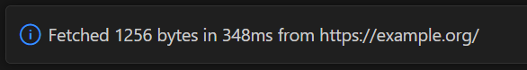
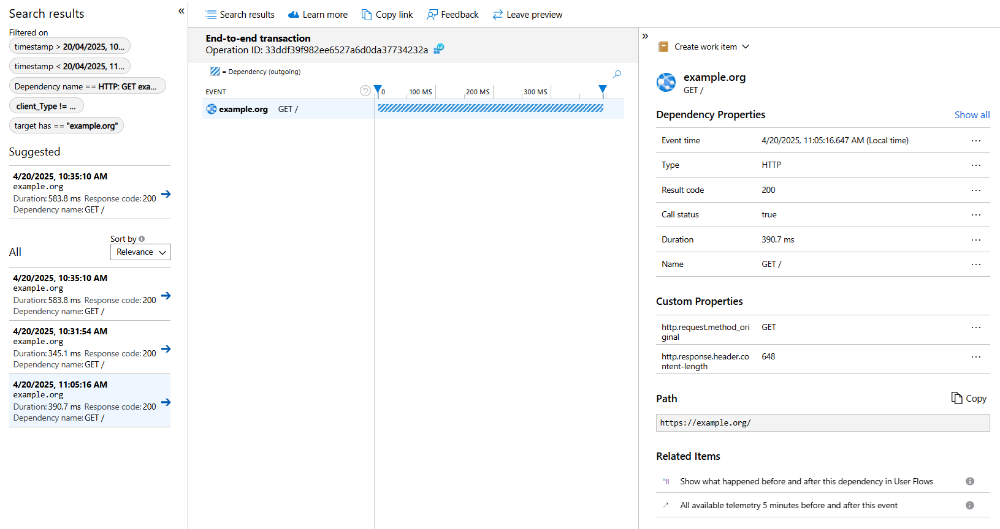

# Quick example to repro OTel Version mismatch

## Setup

### Happy Path

Note: the code in the repo has our workaround enabled.
- in `extension.ts` configure `APPINS_TEST` to point to an Azure App Insights instance
- run `npm install` to install dependencies
- run `npm run compile` to compile the extension
- debug the VS Code extension using F5
- this should open the Extension Development Host window
- open the command palette and run the "Fetch Example" command
- this should activate the extension, send a dummy request to example.org and show a simple message box with info about the fetch request e.g.

- check the Azure App Insights instance to see if the telemetry was sent successfully
- for example, after 3 successfuly runs I can see GETs to example.org:

### Reproduce the original OTel Version mismatch issue
- in `extension.ts` comment out the call to `ensureOpenTelemetryApiMatches`
- repeat all the previous steps
- note the different behavior in verifyExpectedTracerProvider after the initialization without the workaround:
- GET requests to example.org will obviously still work but because of the NoopTracerProvider, telemetry won't be sent and we won't see any additional telemetry in the Azure App Insights instance.

